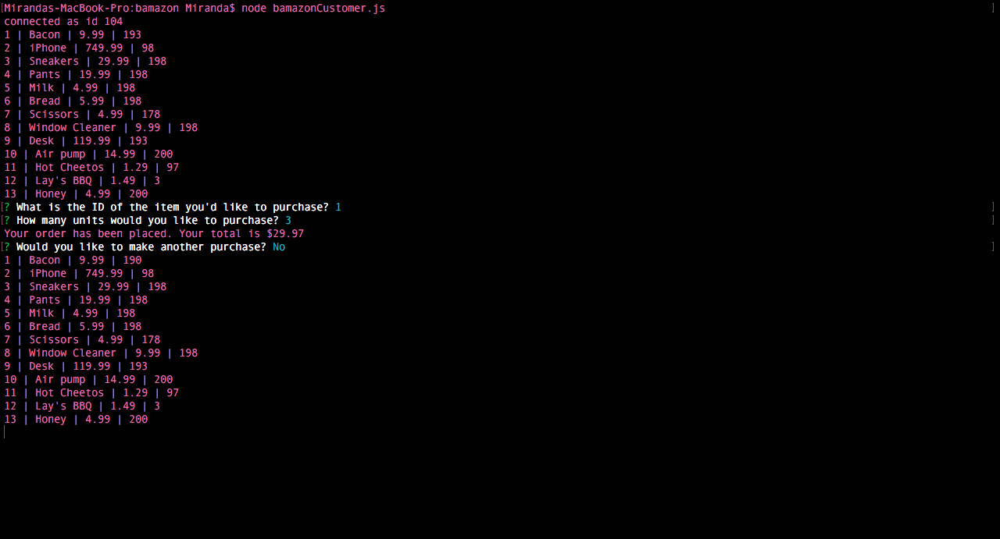
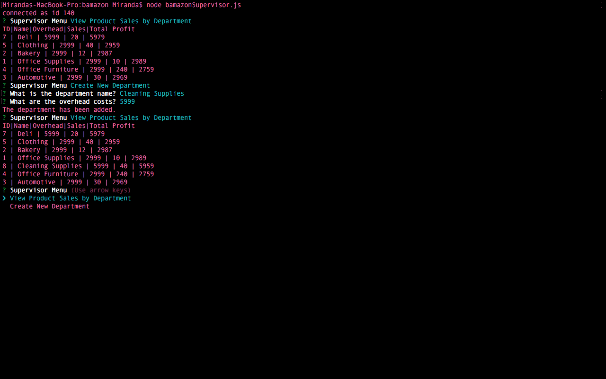

# bamazon

> A store-like CLI built with MySQL, Node.js, and inquirer. The app will take in orders from customers and deplete stock from the store&#39;s inventory. The app is also able to track product sales across your store&#39;s departments and then provide a summary of the highest-grossing departments in the store.

## Table of Contents

- [Usage](#usage)
- [Todo](#todo)
- [Maintainers](#maintainers)
- [License](#license)

## Usage

## Maintainers

[@MirandaAH](https://github.com/MirandaAH)

## License

MIT © 2017 Miranda Hane
